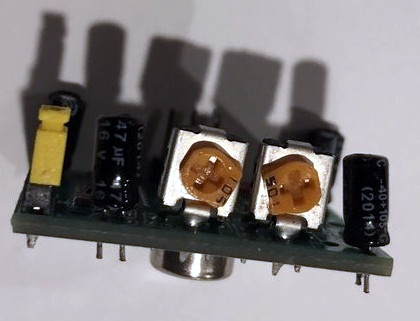

# AudioMoth-Sync

## DESCRIPTION

This project supports the Monash University AgTech Rodent Tracking project, to detect animal activity and trigger recording devices to acquire ultrasonic audio samples and photogrphic evidence required to document the animal activity and identify the related animal species.

<br>
*Original concept of the rodent detection housing*

## CONCEPT

An AudioMoth unit has a Cortex M4 EFM32WG380F256 MCU which is capable of supporting USB access as well as recording audio.
*(The two operations cannot occur at the same time however, as the processors internal capacity to handle the audio buffers and switch SD card access is insufficent)*

Instead, an AudioMoth is connected via USB to a Raspberry PI, and GPIO pins.  The Raspberry PI has PIR senses which detect the infrared emitted from animals.  

When an animal is detected, the Raspberry PI signals to the AudioMoth over GPIO to commence recording, and access to the AudioMoth sound recordings is removed.  In addition to the microphone activity, the Raspberry PI begins taking photos of animals inside the housing.  

When motion stops, after a delay the Raspberry PI signals to the AudioMoth to stop recording.  The AudioMoth enables the Mass Storage Device features on the MCU and the Raspberry PI detects the AudioMoth filesystem and mounts it.  Files are then transferred locally onto a microSD Card used by the Raspberry PI.  Once files are transferred, the recordings are removed from the AudioMoth microSD card, using remote access operations on the mounted filesystem.

A seperate background task, which is always running sends the sound and photo files into the cloud via a WiFi // 4G connection which is available.  Once the files are transmitted successfully to the cloud, the locally stored files are removed from the local device.

## PREREQUISITES

- Raspberry PI ([3B+](https://www.raspberrypi.org/products/raspberry-pi-3-model-b-plus/) or [4B](https://www.raspberrypi.org/products/raspberry-pi-4-model-b/))
    - 16GB or 32GB SD microSD card (For the OS)
    - [Raspbian](https://www.raspberrypi.org/downloads/raspbian/)
    - Power Supply
        - [2.5mA microUSB for RPi 3B+](https://www.raspberrypi.org/products/raspberry-pi-universal-power-supply/)
        - [15W Type-C for RPi 4B](https://www.raspberrypi.org/products/type-c-power-supply/)
        - Battery pack
        - 20W Solar panel and solar controller with load controller and external battery supply with USB support
        - PiJuice with LIPO battery and 20W Solar Panel
    - [RTC for Rpi](https://core-electronics.com.au/ds1307-rtc-module-with-battery-for-raspberry-pi.html)
    - [Duinotech XC9021 5MP Night Vision camera for Raspberry PI](https://www.jaycar.com.au/5mp-night-vision-camera-for-raspberry-pi/p/XC9021)
- AudioMoth (1.0.0 or later)
    - 16GB or 32GB SD microSD card (For the Audio samples)
    - [AudioMoth-MSD firmware](https://github.com/victorromeo/AudioMoth-MSD)
    - 2.54 right angle header 6 pin [female](https://core-electronics.com.au/0-100-2-54-mm-female-header-1x6-pin-right-angle.html) or [male](https://core-electronics.com.au/0-100-2-54-mm-breakaway-male-header-1x40-pin-right-angle.html)
    - [Dupont wires](https://www.altronics.com.au/p/p1017-prototyping-jumper-wires-mixed-for-breadboard-arduino/)
    - [Duinotech Raspberry Pi GPIO Expansion Shield](https://www.jaycar.com.au/duinotech-raspberry-pi-gpio-expansion-shield-with-4-x-ad-da/p/XC9050)
    - AA batteries to provide additional current requirements
- Housing
    - FreeCAD files
    - [Duinotech XC-4444 PIR Infrared Motion Sensor](https://core-electronics.com.au/modmypi-pir-infrared-motion-sensor-hc-sr501.html)
- Construction
    - Hot Glue gun
    - Soldering iron and Solder, used to mount the 6 pin header on the AudioMoth
    - 3D Printer (220 x 220 x 250 print bed), e.g. Ender 3
    - Silicon sealant

## RASPBERRY PI SETUP

### Setup of the Camera


1. Run Raspi-Config to enable camera interface
    - `sudo raspi-config` ... `Interface Options` ... `Enable Camera` ... `Finish`
2. Power off the Raspberry PI
3. Plug in the 5 MP Nightvision camera
4. Power on the Raspberry PI
5. Execute `raspistill -o test.jpg` to validate that the camera is working, a file with the name test.jpg should appear in the current folder. If a screen is connected, view the image to validate that the photo is in focus.  If no screen is attached to the raspberry pi, use file transfer to view the image.

### Setup of the Realtime Clock

1. Run Raspi-Config to enable the I2C interface
    - `sudo raspi-config` ... `Interface Options` ... `Advanced Options` ... `I2C` .. `Finish`
2. Power off the Raspberry PI
3. Connect the RTC unit over pins 1-10 of the Raspberry PI
4. Power on the Raspberry PI
5. In a terminal window check to ensure the RTC chip is detected
    - `sudo i2cdetect -y 1` ... 68, which is the RTC hexidecimal I2C address of the device should appear
6. Load the RTC module
    - `sudo modprobe rtc-ds1307`
7. Register the device
    - `sudo echo ds1307 0x68 > /sys/class/i2c-adapter/i2c-1/new_device`
8. Read the time from the RTC
    - `sudo hwclock -r`
9. If the Raspberry PI device is connected to the internet via WiFi or Ethernet, check the time
    - `date`
10. Write the time to the RTC
    - `sudo hwclock -w`
11. Add the RTC clock to the Raspberry PI modules list
    - `sudo nano /etc/modules` and add `rtc-ds1307` at the end of the file. Save (Control + o) and exit (Control + x, y).
12. Add the RTC clock to the boot script
    - `sudo nano /etc/rc.local` and add the following.

    ```
    echo ds1307 0x68 > /sys/class/i2c-adapter/i2c-1/new_device
    sudo hwclock -s
    date
    ```
    Save (Control + o) and exit (Control + x, y).
13. Disconnect the network and check that time is still accessible
    - `date`

### Setup Python 3

1. Update the list of available packages
    - `sudo apt update`
2. Upgrade the currently installed packages
    - `sudo apt upgrade`
3. Install the picamera component
    - `sudo apt install python3-picamera`

### Setup Sync Scripts

1. Change to home directory of
    - `cd ~`
2. Clone the scripts into the root directory
    - `git clone https://github.com/victorromeo/AudioMoth-Sync.git`

### Setup Cron Job

1. Change to the directory of the AudioMoth-Sync
    - `cd ~/AudioMoth-Sync`
2. Update exec permission on the launcher script
    - `chmod 755 launcher.sh`
3. Test that the script executes
    - `sh launcher.sh`
4. Add launcher.sh to crontab
    - `sudo crontab -e` and add the following to the end of the file
    - `@reboot sh /home/pi/AudioMoth-Sync/launcher.sh > /home/pi/AudioMoth-Sync/logs/cronlog 2>&1`
5. Power off the Raspberry PI
6. Power on the Raspberry PI
7. Troubleshoot by inspecting the logs
    - `cat /home/pi/AudioMoth-Sync/logs/cronlog`

## AUDIOMOTH SETUP

### Flash the firmware

1. Download the firmware from AudioMoth-MSD
2. Connect the AudioMoth to a PC a USB cable
3. [Flash](https://github.com/OpenAcousticDevices/Flash) the device, using the AudioMoth-Project.bin file and instructions on the flash project.  Briefly this can be explained as follows
    - Connect pins 1 and 3 together, (pulling the SWCLK to VCC)
    - Change the switch to the Custom setting on the AudioMoth
    - `flash -i /dev/ttyACM0` or similar, to get the serial number
    - `flash -u /dev/ttyACM0 AudioMoth-Project.bin` (execute several times as needed to get the firmware to upload onto the device)

### Connectors


1. Solder the 2.54 right angle header 6 pins onto the AudioMoth
2. Connect Dupont connectors onto the pins, exposing female connectors on the opposite end available to connect onto the Raspberry PI


## CONSTRUCTION

### 3D Print the housing 

You will require
- 1 x Lid
- 1 x Electronics Unit
- 1 x Electronics Base
- 1 x AudioMoth Holder
- 1 x Raspberry PI Holder
- 2 x Trap Sides
- 2 x Trap Brackets
- 2 x Tunnels
- 2 x PIR Cover
- 1 x Peg Bracket

<br>
*Housing*

### PIR Installation


1. Sit the PIR unit in the hole in top of the Tunnel, white dome facing downward, and secure with Hot Glue to prevent movement.


2. Connect Dupont cables to the 3 header pins point upward.
The pins are VCC (5 Volt), OUT (3.3V Max), GND

3. Tune the PIR sensitivity as required.  Default settings should be adequate. 



### Wiring GPIO 

<br>
*GPIO Expansion Header*

<br>
*AudioMoth Pins - On AudioMoth 1.x.0 pin closest to the corner is Ground*

RED

1. GND - AudioMoth PIN 6
2. RST - AudioMoth PIN 5
3. SWO - AudioMoth PIN 4
4. SWCLK - AudioMoth PIN 3
5. SWDIO - AudioMoth PIN 2

BLUE

6. PIR 1 OUT (5V and GND pins needed also)  
7. PIR 2 OUT (5V and GND pins needed also)
